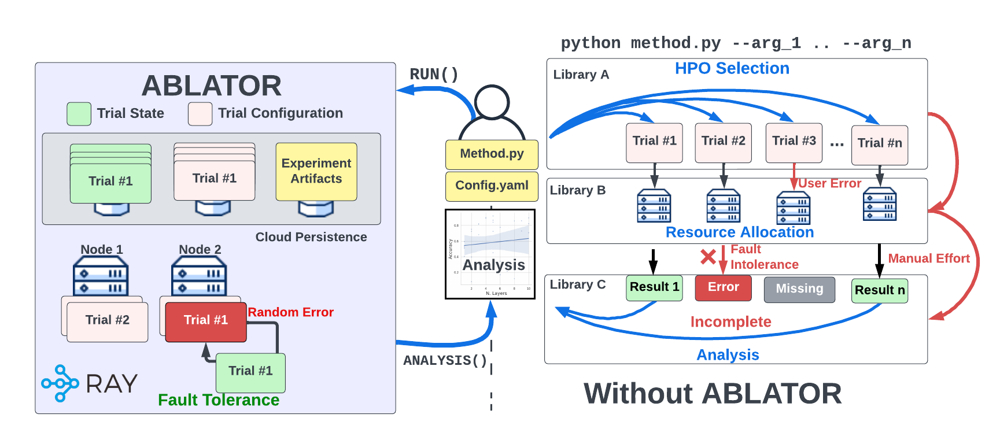
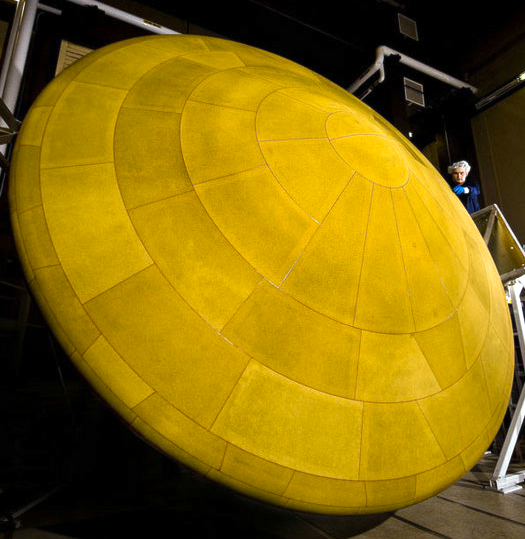

# ABLATOR

A distributed experiment execution framework for ablation studies. ABLATOR provides a wrapper for your model and a Trainer class for you to prototype on your method and scale to thousands of experimental trials with 1 code change.

Ablation studies are experiments used to identify the causal effects on a method performance. For example, `does your novel layer really improve performance?`

## What are Ablators?
Ablators are materials that are depleted during operation ([NASA](https://www.nasa.gov/centers/ames/thermal-protection-materials/tps-materials-development/low-density-ablators.html)). An experimental ABLATOR should not interfere with the experimental result.

## Why ABLATOR?
 1. Strictly typed configuration system prevents errors.
 2. Seamless prototyping to production
 3. Stateful experiment design. Stop, Resume, Share your experiments
 4. Automated analysis artifacts
 5. Template Training

### What is the difference with using `xxx`

Comparison table with existing framework:

| Framework      | HPO            | Configuration  | Training       | Tuning         | Analysis       |
|----------------|----------------|----------------|----------------|----------------|----------------|
| Ray            | :white_check_mark:     | :x:         | :x:         | :white_check_mark:     | :x:         |
| Lighting       | :x:         | :x:         | :white_check_mark:     | :x:         | :x:         |
| Optuna         | :white_check_mark:     | :x:         | :x:         | :x:         | :white_check_mark:     |
| Hydra          | :x:         | :white_check_mark:     | :x:         | :x:         | :x:         |
| **ABLATOR** | :heavy_check_mark: | :heavy_check_mark: | :heavy_check_mark: | :heavy_check_mark: | :heavy_check_mark: |

Features compared, hyperparameter selection (`HPO`), removing boilerplate code for configuring experiments (`Configuration`), removing boiler plate code for running experiments at scale (`Tuning`) and performing analysis on the hyperparameter selection (`Analysis`).

Using:
1. Ray: You will need to write boiler-plate code for integrating with a configuration system (i.e. Hydra), saving experiments artifacts or logging (i.e. integrate with Wandb).

2. Lighting: You will need to write boiler-plate code for HPO (i.e. using Optuna), Configuring experiments (i.e. Hydra) and horizontal distributed execution (i.e. integrate with Ray)

3. Hydra: The configuration system is not strongly typed (ABLATOR), and does not provide support for common ML use-cases where configuration attributes are **Derived** (inferred during run-time) or **Stateless** (change between trials). Additionally, ABLATOR provides support for custom objects that are dynamically inferred and initialized during execution.

4. ABLATOR: Combines Ray back-end, with Optuna for HPO and removes boiler-plate code for fault tollerant strategies, training, and analyzing the results.

Integrating different tools, for distributed execution, fault tollerance, training, checkpointing and analysis is **error prone**! Poor compatibility between tools, verisioning errors will lead to errors in your analysis.

You can use ABLATOR with any other library i.e. PyTorch Lighting. Just wrap a Lighting model with ModelWrapper. For examples please look [examples](examples)

Spend more time in the creative process of ML research and less time on dev-ops.

### Pre-Release - Phase

The library is under active development and a lot of the API endpoints will be removed / renamed or their functionality changed without notice.

### Install

Use a python virtual enviroment to avoid version conflicts.

`pip install git+https://github.com/fostiropoulos/ablator.git`

For Development

1. `git clone git@github.com:fostiropoulos/ablator.git`
2. `cd ablator`
3. `pip install -e .[dev]`

